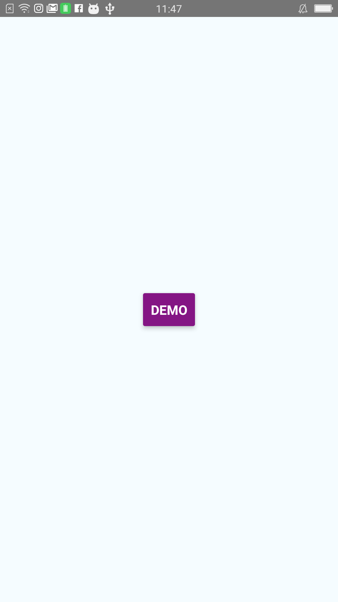
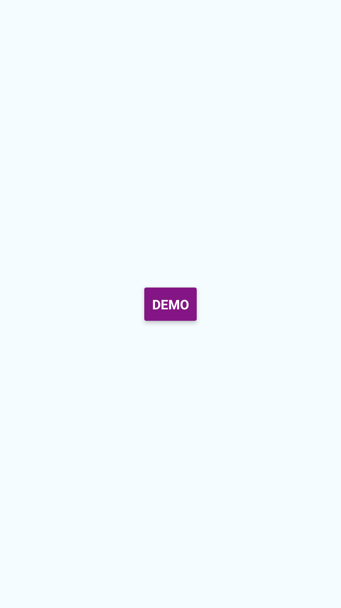

# RNStatusBar

#### Demo - Show Status Bar



#### Demo - Hide Status Bar



#### How to use ?
1. Add the ```ReactPackageManagement.java```  and ```RNStatusBar.java``` files to your android studio project.

2. Modify the ```MainApplication.java``` java code in android studio project
```java
protected List<ReactPackage> getPackages() {
   return Arrays.<ReactPackage>asList(
   new MainReactPackage(),
   new ReactPackageManagement());
}
```

3. Modify the JS code in ```index.android.js```
First of all, Import the RNStatusBar module.
```javascript
import {
  ....,
  NativeModules
} from 'react-native';
```
Secondly, declare the variable of RNStatusBar
```javascript
var statusBar = NativeModules.RNStatusBar;
```
Finally, using it!
```javascript
statusBar.showStatusBar(bShow, function () {
   console.log('showStatusBar');
});
```
